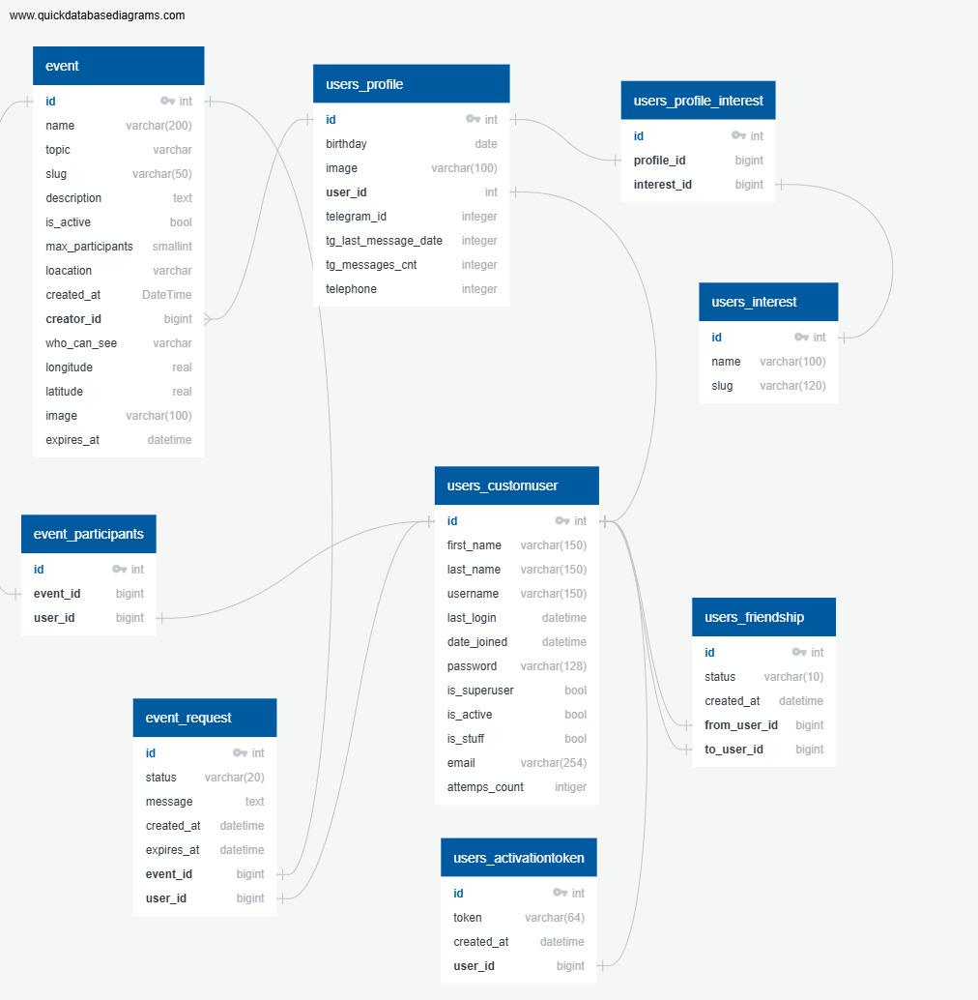

## Проект "Встречалки", разработанный в рамках обучения в Яндекс Лицее

[](https://gitlab.crja72.ru/django/2025/autumn/course/projects/team-8/-/pipelines)

Перед запуском убедитесь, что у вас установлены:

- [Python релизные версии от 3.10 до 3.12 включительно](https://www.python.org/downloads/)
- [Последняя версия git](https://git-scm.com/install/???Download??git)
- pip (устанавливается вместе с питоном)
- virtualenv (устанавливается вместе с питоном)

## Клонирование репозитория

Для клонирования репозитория на свой компьютер воспользуйтесь следующей командой:

```bash
git clone https://gitlab.crja72.ru/django/2025/autumn/course/projects/team-8
```

И перейдите в папку с проектом:

```bash
cd team-8
```

## Установка

**Создание виртуального окружения**

Linux/MacOS

```bash
python3 -m venv venv
```

Windows

```bash
python -m venv venv
```

Активировать среду на Linux/MacOS

```bash
source venv/bin/activate
```

Или на Windows

```bash
venv\Scripts\activate
```

Установите зависимости (для разработки)

```bash
pip install -r requirements/dev.txt
```

**Для тестирования**

```bash
pip install -r requirements/test.txt
```

**Для продакшена**

```bash
pip install -r requirements/prod.txt
```

Перед запуском следует настроить ```.env``` файл. Создайте его и
создайте в нём переменную ```DJANGO_SECRET_KEY``` со значением вашего секретного ключа.

Также создайте в нём переменную ```TELEGRAM_BOT_TOKEN``` со значением вашего токена
для телеграм-бота. Это нужно для рассылки уведомлений.

```DJANGO_MAIL``` переименуйте на почту, с которой ваш сайт будет отправлять письма,
```DJANGO_EMAIL_HOST```-ваш smtp-сервер, ```DJANGO_EMAIL_PORT```-порт для отправки
писем, ```DJANGO_EMAIL_PASSWORD```-пароль для отправки писем

Переименуйте папку media_example в media, а в файле .env
поменяйте значение ```DJANGO_MEDIA``` на ```media```

**Для linux/MacOS**

```bash
cp example.env .env
```

**Для Windows**

```bash
copy example.env .env
```

**ВНМАНИЕ! Измените значение переменной DJANGO_SECRET_KEY в появившемся .env файле**

**Переход в папку randoccasion на Windows/Linux/MacOS**

```bash
cd randoccasion
```

**Загрузка фикстуры в базу данных**
Linux/MacOS

```bash
python3 manage.py loaddata fixtures/data.json
```

Windows

```bash
python manage.py loaddata fixtures/data.json
```

**Создание суперпользователя**

Для создания аккаунта администратора воспользуйтесь следующей командой:

Linux/MacOS

```bash
python3 manage.py createsuperuser
```

Windows

```bash
python manage.py createsuperuser
```

[Админка](http://127.0.0.1:8000/admin/)

Укажите логин, почту и пароль для аккаунта администратора

## Настройка динамических переводов

В файле ```.env``` в переменной ```DJANGO_LANGUAGE_CODE``` укажите код языка,
который вы хотите установить в проекте по умолчанию.

Если вашего языка нет в списке ```LANGUAGES``` в ```settings.py```, то добавьте в переменную кортеж
с кодом вашего языка и названием языка на английском так, как это сделано с остальными
языками.
Затем в консоли введите команду:

```bash
django-admin makemessages -l <код вашего языка>
```

Затем зайдите в директорию ```lyceum/locale/<код вашего языка>/LC_MESSAGES```
Затем в файле ```django.mo``` вбейте в пустые строки рядом с msgstr перевод строк,
которые находятся рядом с msgid.

Затем вернитесь в папку ```lyceum``` и выполните команду:

```bash
django-admin compilemessages 
```

Готов, теперь сайт переведён на ваш язык!

## Запуск сервера

Linux/MacOS

```bash
python3 manage.py runserver
```

Windows

```bash
python manage.py runserver
```

Также мы рекомендуем Вам открыть второй
терминал и запустить телеграм-бота для
связки аккаунтов пользователей. Это можно сделать через:

Linux/MacOS

```bash
python3 runbot.py
```

Windows

```bash
python runbot.py
```

[Ссылка на главную страницу сайта](http://127.0.0.1:8000/)

## Устройство API

Работа API осуществляется через API-ключ. Для его генерации
нужно зайти на страницу ```/api/v1/apikey-create/``` по логину и паролю
администратора.

Для просмотра объектов хватит API-кдюча, но для их
создания потребуется войти под своей учётной записью через API.

Пути для работы с API:

```/api/v1/register/``` POST-запрос, в body запроса укажите username, email, password и password_confirm для регистрации

```/api/v1/login/``` POST-запрос, в body запроса укажите username и password для авторизации

```/api/v1/users/``` GET-запрос, возвращает информацию о пользователях

```/api/v1/users/<int:pk>/```  GET-запрос, получение информации о пользователе

```/api/v1/register/``` POST-запрос, создание пользователя

```/api/v1/events/``` GET, POST-запросы. Для GET возвращает события, которые доступны для просмотра всем. Для POST
создаёт новое событие

```/api/v1/events/<int:pk>/``` GET-запрос, возвращает событие по id

```/api/v1/interests/``` GET, POST-запросы. Для GET возвращает все интересы. Для POST создаёт новый интерес

```/api/v1/interests/<int:pk>/``` GET-запрос, возвращает интерес по id

## Архитектура базы данных проекта

